# Healthcare Claims Analytics: Where Is Claim Revenue Being Lost?

End-to-end data analysis of **50,000 health-insurance claims (2024–2025)** using **Python, SQL, Excel and Power BI**.
The project finds why claims are denied, which providers and plans drive the problem, and how much money is at stake.

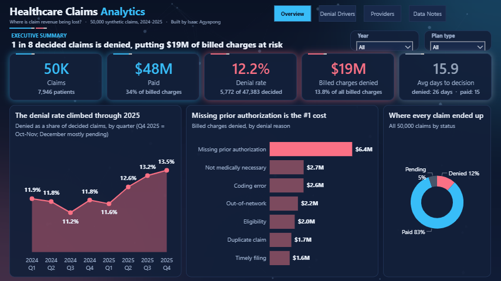

---

## Business problem

A health plan's payer-relations team sees denied claims rising but can't say where to act first.
They asked four questions:

1. How much billed revenue is being denied, and is it getting worse?
2. **Why** are claims denied?
3. **Which** providers, plans and network arrangements drive denials?
4. Which fixes would recover the most money?

## Key findings

| | Finding | Evidence |
|---|---|---|
| 💰 | **$19.2M of billed charges (13.8%) were denied**; overall denial rate 12.2%. | SQL Q1 |
| 📈 | **Missing prior-authorization denials almost doubled (+99%) from 2024 to 2025** and are now the #1 reason, at 34% of denied dollars. Inpatient denial rates climbed from about 12–15% in 2024 to about 20% by late 2025. | SQL Q3–Q4, chart 2–3 |
| 🌐 | **Out-of-network claims are denied about 2x as often** (20–25% vs 9–12%), on every plan type. | SQL Q5, chart 4 |
| 🏥 | **3 providers sit 19–25 points above their peer group**, driven by coding errors and duplicate claims. | SQL Q6–Q7, chart 5 |
| ⏱️ | **Claims submitted more than 90 days after service are always denied** (timely filing: $1.6M, all preventable). Denied claims also take **23 vs 13 days** to resolve. | SQL Q11–Q12, chart 7 |

## Recommendations

1. **Prior-auth check at scheduling** for inpatient and imaging services, the biggest and fastest-growing leak (~$6.4M).
2. **Billing audit and education for the 3 flagged providers**; a claim scrubber catches coding and duplicate errors before submission.
3. **Steer referrals in-network** and target recruiting at high-volume out-of-network specialties.
4. **Alert at 60 days** for any service not yet submitted, which removes timely-filing denials entirely.

---

## Tools and what each one does

| Stage | Tool | Output |
|---|---|---|
| Data generation | Python (NumPy, pandas) | [`Python/generate_data.py`](Python/generate_data.py): realistic claims with built-in data-quality problems |
| Cleaning | Python (pandas, Jupyter) | [`01_data_cleaning.ipynb`](Python/01_data_cleaning.ipynb): deduplication, mixed date formats, imputation, 10 validation checks |
| Exploratory analysis | Python (matplotlib) | [`02_exploratory_analysis.ipynb`](Python/02_exploratory_analysis.ipynb): 7 charts and findings |
| Database and analysis | SQL (SQLite) | [`SQL/`](SQL/): star schema, data-quality checks, 13 business queries → [results](SQL/query_results.md) |
| Spreadsheet model | Excel | [`Excel/Healthcare_Claims_Analysis.xlsx`](Excel/Healthcare_Claims_Analysis.xlsx): formula-driven dashboard, provider scorecard, conditional formatting |
| BI dashboard | Power BI (DAX, TMDL, PBIR) | [`dashboard/`](dashboard/): 4-page interactive report saved as a Power BI Project, generated from code |

**SQL skills shown:** multi-table JOINs, CTEs, CASE, conditional aggregation, window functions
(`LAG`, `SUM() OVER`, `AVG() OVER (PARTITION BY)`, `ROW_NUMBER`, `DENSE_RANK`, `NTILE`), and a median calculated without a MEDIAN function.

**Excel skills shown:** `COUNTIFS` / `SUMIFS` / `AVERAGE`, running YTD totals, structured tables, data bars, colour scales, auto-filter, charts.

**Power BI skills shown:** star-schema model, Power Query (M) with a folder parameter, marked date table, time intelligence (`TOTALYTD`), peer benchmarking with `CALCULATE` / `REMOVEFILTERS`, dynamic Top N with `RANKX`, conditional formatting driven by a measure, and a version-controlled PBIP project.

---

## Charts

| | |
|---|---|
| 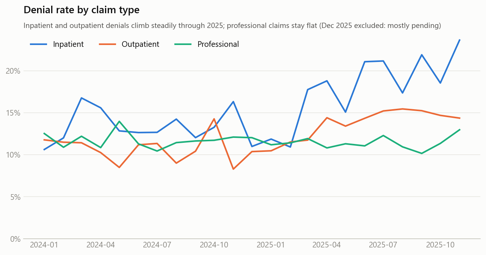 | 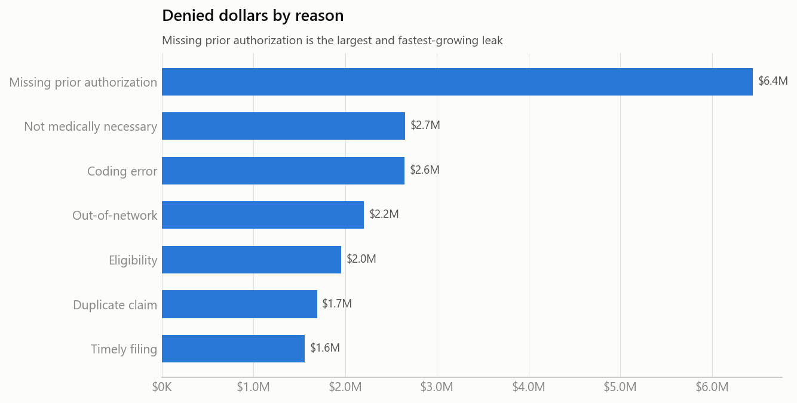 |
| 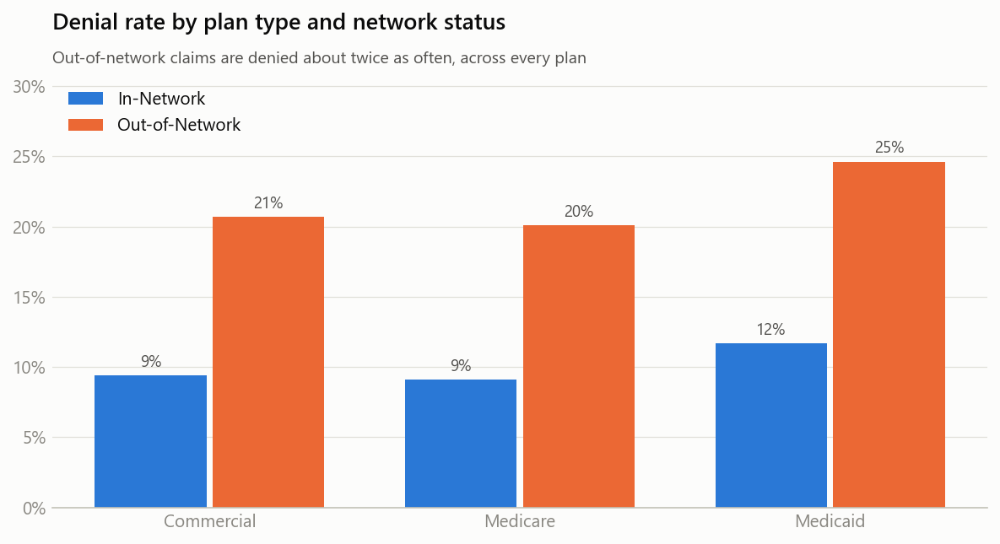 | 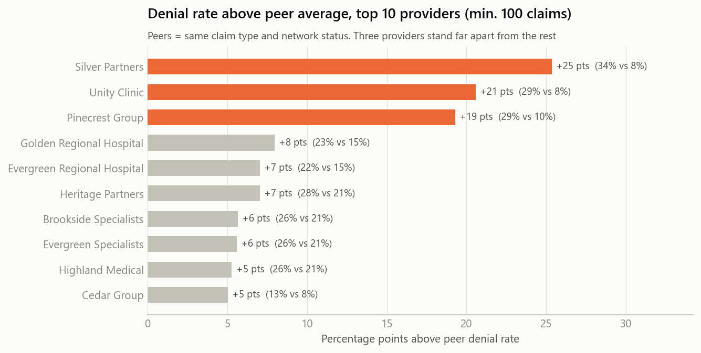 |
| 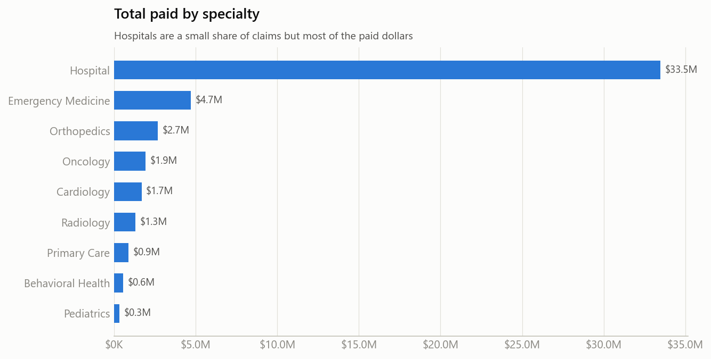 | 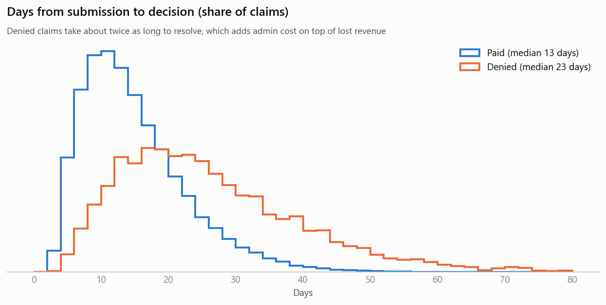 |

## Power BI dashboard

A 4-page report saved as a **Power BI Project (`.pbip`)** and generated from code
([`Python/build_powerbi_project.py`](Python/build_powerbi_project.py)), so the model (TMDL), every visual (PBIR JSON)
and all 44 DAX measures can be read on GitHub.

**Design choices**
- Dark "command centre" theme: deep-navy background with a generated network-of-nodes pattern
  ([`Python/make_background.py`](Python/make_background.py)), dark glass tiles, KPI cards that glow in their meaning colour,
  and pill-shaped page navigation.
- A headline sentence on every page that states the finding, and a context line on every KPI card.
- One colour, one meaning: **cyan** = claims and payments, **rose** = denials and revenue at risk,
  **gold** = flagged providers, slate = everything else.
- Year and plan-type filters on every analysis page; rankings are protected from cross-filtering so they always rank all providers.

**Executive summary**: KPIs, quarterly denial rate, denied dollars by reason, claim status


**Denial drivers**: prior-auth denials by quarter, plan × network denial rates, denials by reason 2024 vs 2025
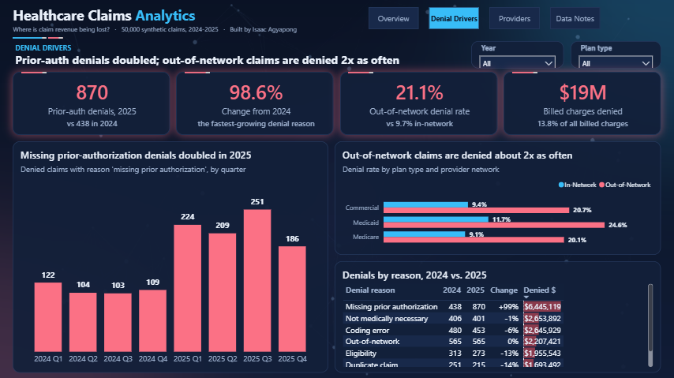

**Provider scorecard**: providers ranked by points above their peer group (gold = 10+ points)
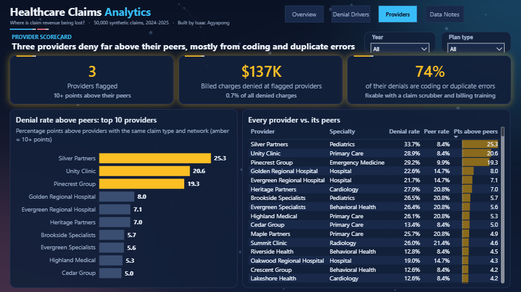

**Data notes**
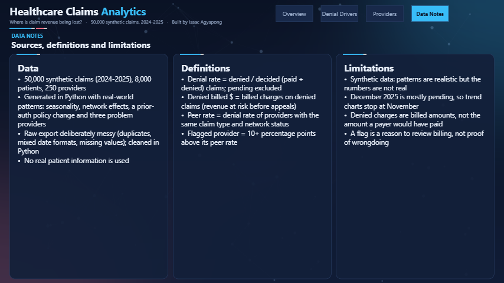

**Excel version** of the dashboard (formula-driven):
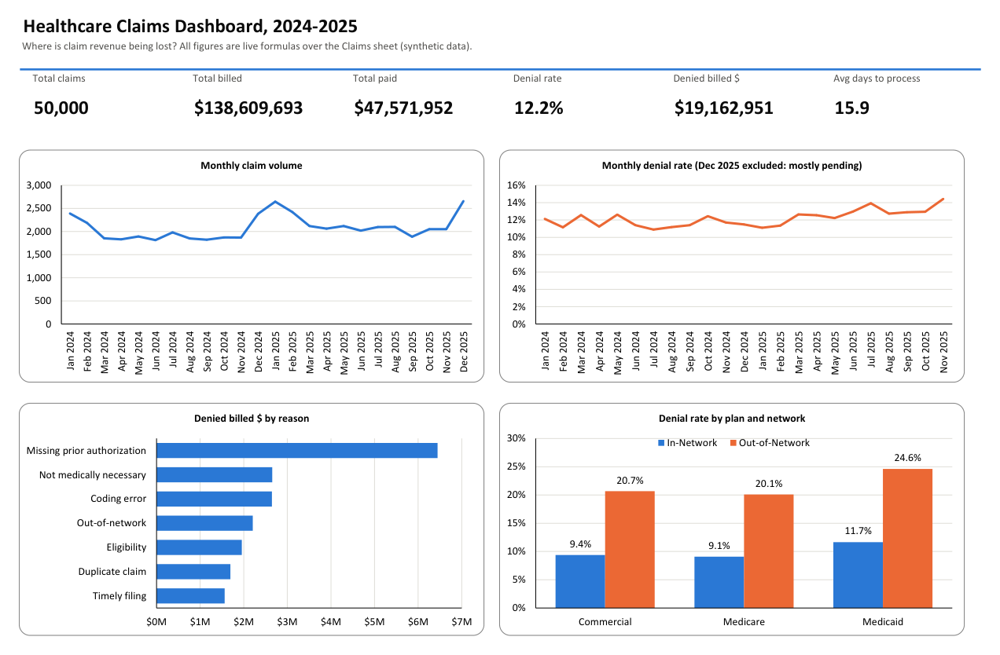
To open: `dashboard/Healthcare_Claims.pbip` in Power BI Desktop. If you cloned to a different folder,
set the `DataFolder` parameter (**Transform data → Edit parameters**) to your `Data\clean\` path, then **Refresh**.

---

## Data

| Table | Rows | Grain |
|---|---|---|
| `claims` | 50,000 | one row per claim |
| `patients` | 8,000 | one row per member (plan type, age, state) |
| `providers` | 250 | one row per provider (specialty, network status) |

The raw export intentionally contains the problems real data has: 750 duplicate rows, two date formats, inconsistent
coding (`F` / `female` / `Female`), and missing and negative billed amounts. Each fix is documented in notebook 01.

> **Note:** the data is **synthetic**, generated by `Python/generate_data.py` with a fixed seed. No real patient
> information is used. The patterns (seasonality, network effects, a prior-auth policy change, problem providers)
> were modelled on common real-world claims issues so the analysis techniques transfer directly.

## Project structure

```
Healthcare_Claims_Analytics/
├── Data/
│   ├── raw/                 # messy source files
│   └── clean/               # analysis-ready CSVs (used by SQL, Excel, Power BI)
├── Python/                  # generator, notebooks, SQL loader, Excel builder
├── SQL/                     # schema, data-quality checks, business queries, results
├── Excel/                   # formula-driven workbook
├── dashboard/               # Power BI project (.pbip), model, report and DAX
├── Image/                   # charts and screenshots
├── run_all.py               # rebuilds everything
└── requirements.txt
```

## How to run

```bash
pip install -r requirements.txt
python run_all.py
```

This regenerates the data, runs both notebooks, builds `Data/claims.db`, runs every SQL query into
`SQL/query_results.md`, and rebuilds the Excel workbook. Open the `.xlsx` in Excel; formulas calculate on open.
